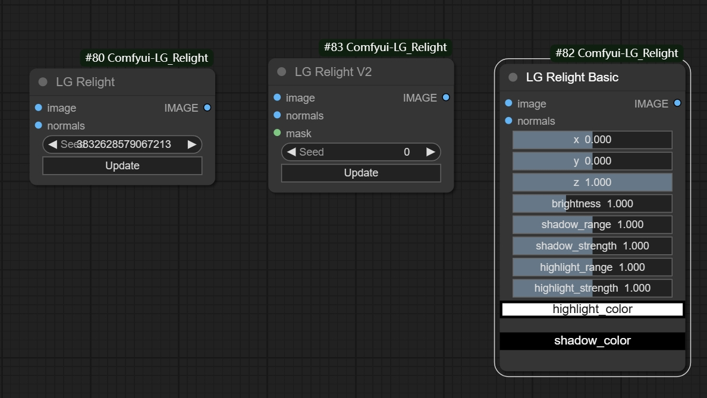
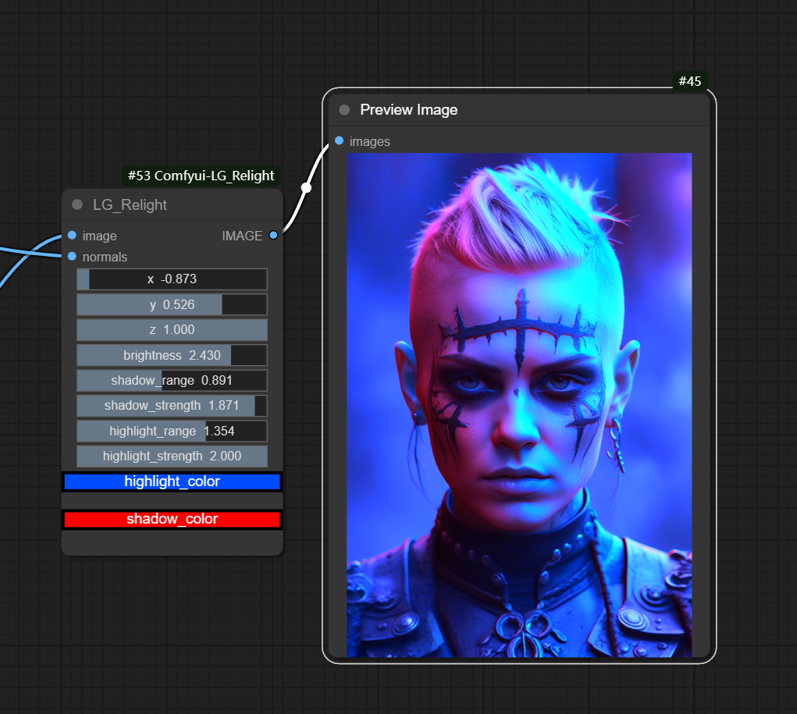
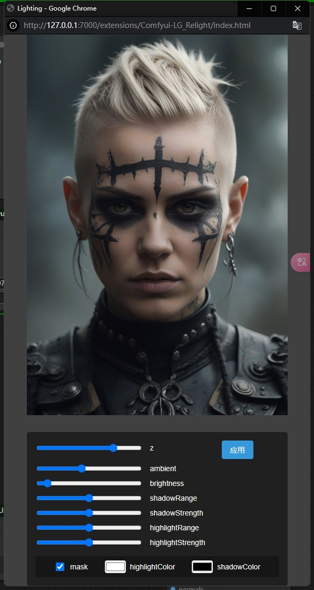
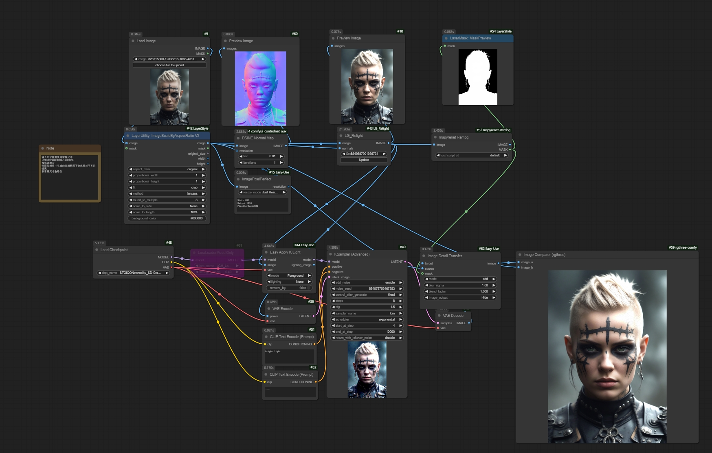

# Comfyui-LG_Relight

Comfyui中3D实时打光的简单实现
开源节点哈，祝大家玩的开心！

## 更新V2版和Basic版，支持本地和云端

* 第二版参考 "还是叫我浪味仙" 大佬提供的代码，以及某低调的图像处理大佬"小拽"，向大佬们学习！

##
* 普通打光

* 添加颜色打光

* 工作流在assets/LG_Relight.json

单一的节点打光效果有限，配合ic_light效果更佳

# 商务合作联系
VX:wenrulaogou2033
