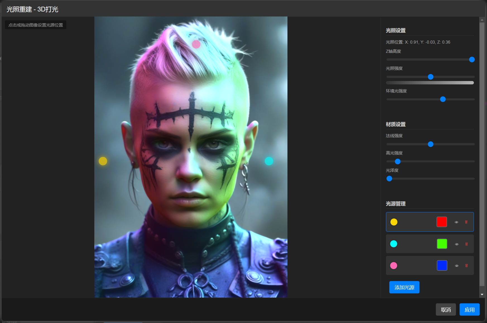
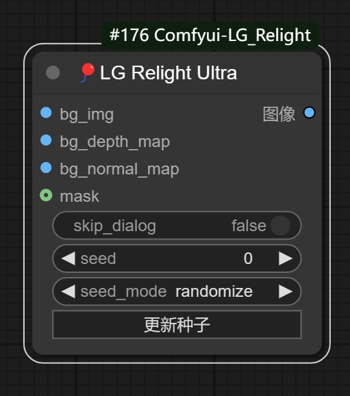
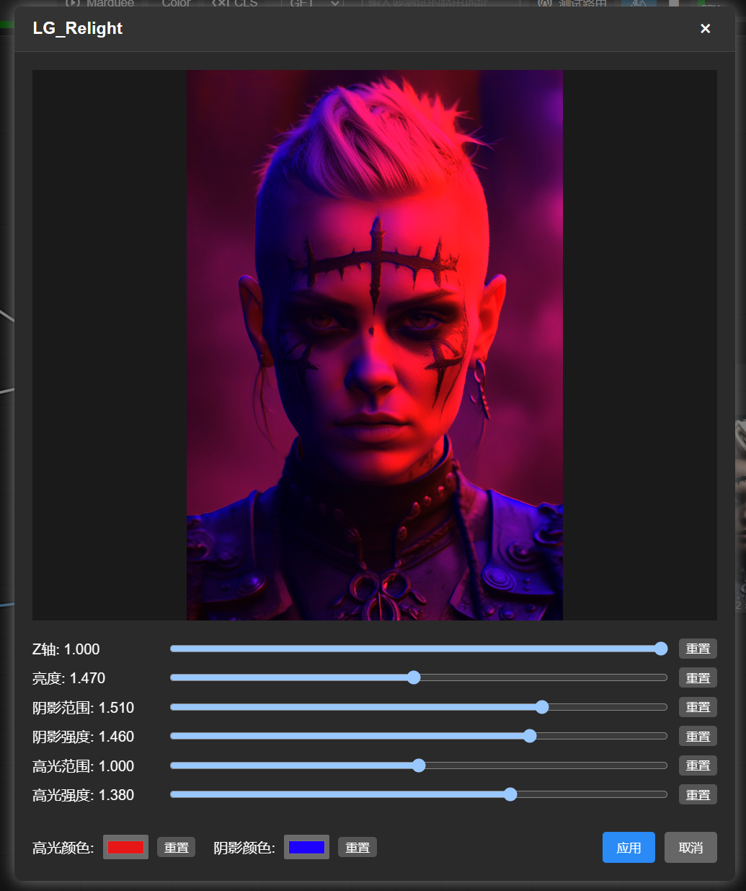

# Comfyui-LG_Relight

Comfyui中3D实时打光的简单实现
开源节点哈，祝大家玩的开心！

## 新增ULTRA版本，支持添加多个光源并且独立调整，实现更全面的3D打光

* 2025/5/14加更skip_dialog跳过弹窗功能，一次设置，批量复用，修复若干BUG以及UI

## 更新模态弹窗，彻底解决弹窗问题 
- 弃用原来的PYQT和JS版本，目前版本支持所有系统，解决弹窗问题，操作方式和原来一致

单一的节点打光效果有限，配合ic_light效果更佳

# 商务合作联系
VX:wenrulaogou2033
